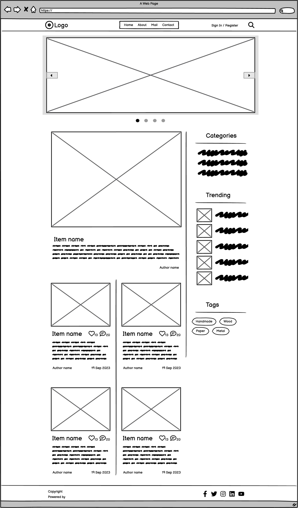
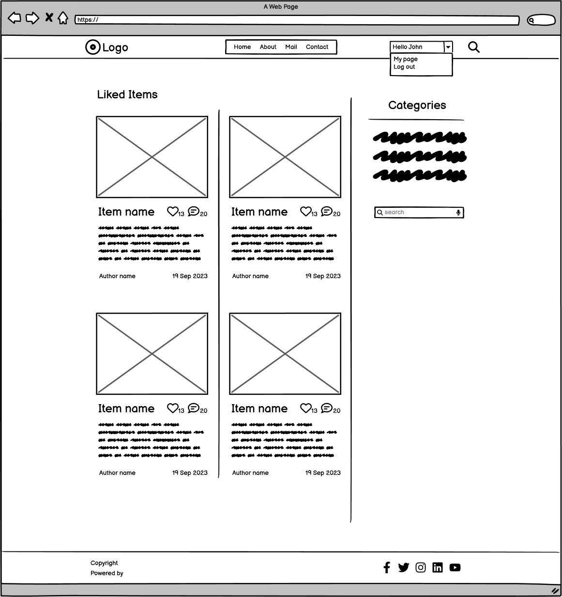
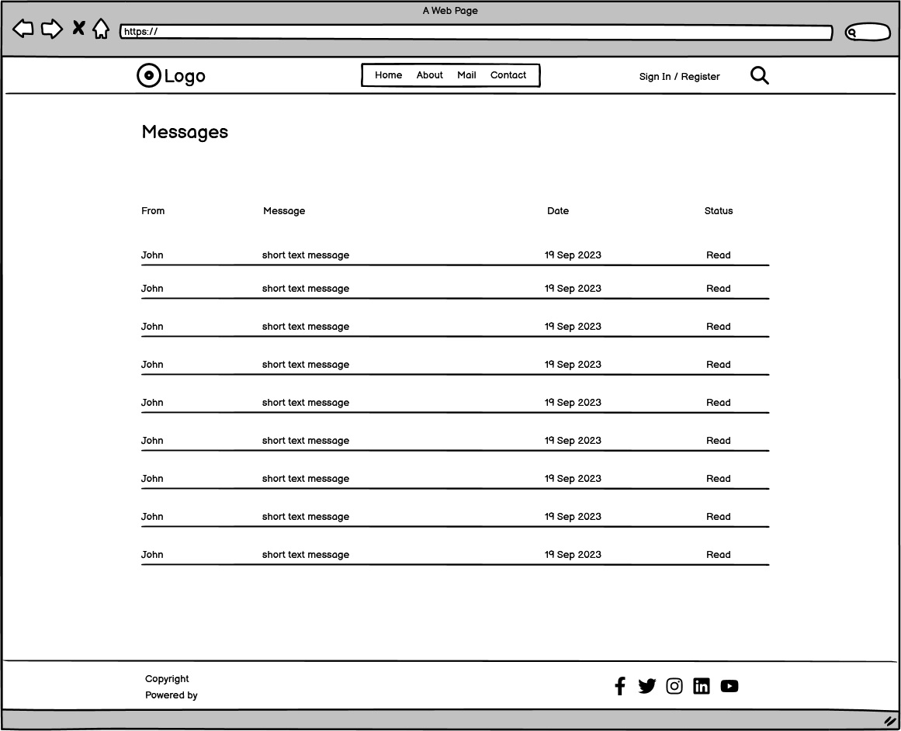
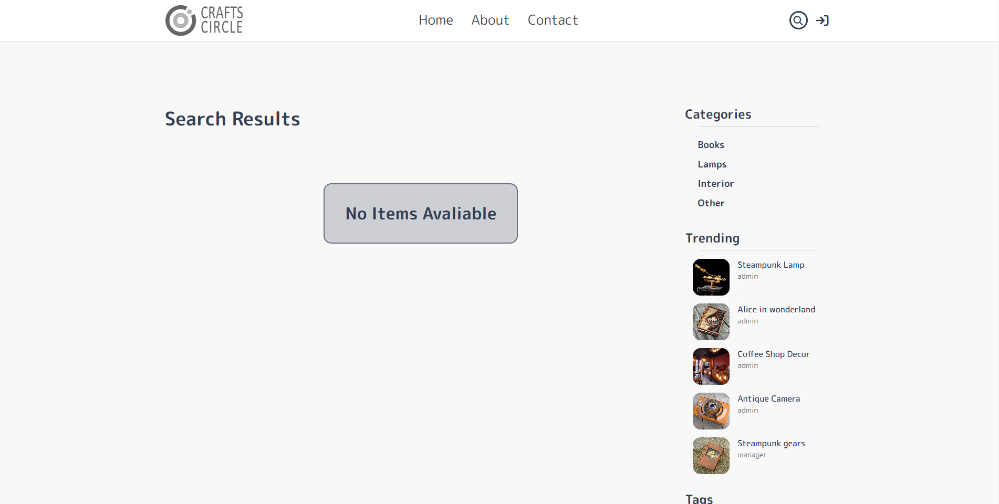

# Crafts Circle Website

The Crafts Circle website is designed to be a responsive website allowing visitors to view it on a range of devices. It allows visitors to view and post handmade items.

[View Crafts Circle on Heruko](https://craftscircle-9727f9958766.herokuapp.com/)

The account to access admin panel:
  - user name: admin2
  - password: masri12345 

---

## CONTENTS

- [Crafts Circle Website](#crafts-circle-website)
  - [**CONTENTS**](#contents)
  - [**User Experience (UX)**](#user-experience-ux)
    - [Initial Discussion](#initial-discussion)
    - [Agile](#agile)
  - [**Design**](#design)
    - [Color Scheme](#color-scheme)
    - [Typography](#typography)
    - [Imagery](#imagery)
    - [Features](#features)
    - [General features on each page](#general-features-on-each-page)
    - [Accessibility](#accessibility)
  - [**Technologies Used**](#technologies-used)
    - [Languages Used](#languages-used)
    - [Frameworks, Libraries \& Programs Used](#frameworks-libraries--programs-used)
  - [**Deployment \& Local Development**](#deployment--local-development)
    - [Deployment](#deployment)
    - [Local Development](#local-development)
      - [How to Fork](#how-to-fork)
      - [How to Clone](#how-to-clone)
  - [**Testing**](#testing)
  - [**Credits**](#credits)
    - [Code Used](#code-used)
    - [Content](#content)
    - [ Media](#media)
    - [ Acknowledgments](#acknowledgments)

---

## **User Experience (UX)**

 

### Agile
The Agile methodology was used to plan the project. Github was used as the tool to demonstrate this.
1. Projects were used to divide the project into three iterations with a simple Kanban board.
2. Milestones were used to create Epics with a custom template.
3. Issues were used to create User Stories with a custom template. Each user story is clearly described with a title, statement, acceptance criteria and tasks.
The user stories were labelled 'must have' 'should have' and 'could have' in order to priorities the work.

### Project Goal
The goal of the project is to create a handmade website for handmade lovers and artisans to share there work like, and comment on others artisans work.
I also wanted to implement a messaging system so that the users are able to contact the artisan or the manage who posted the item if the time frame allows it.

The target user is someone: 
* who wants to find handmade items and ideas for presents.
* who wants to find an artisan to order a custom item from.
* who is an artisan who wants to post his work for potential clients to see. 
* who is an artisan who wants have some feedback on his work. 

### Epics and User Stories
There are 6 Epics and 24 User Stories.

1. Epic: View Items
* User Stories:
  * As a unregistered user / registered user / manager I can view a slider of random items so that I can choose one of the items
  * As a unregistered user / registered user / manager I can view a list of items so that I can choose an item to check
  * As a unregistered user / registered user / manager I can click on an item so that I can open the items page and check the information
  * As a unregistered user / registered user / manager I can click on a featured item post so that I can open the items page and check the information
  * As a unregistered user / registered user / manager I can search items by title so that I can find the item I need
  * As a registered user / manager I can click on favorite page so that I can check the items I have liked
  * As a manager I can click on my so that I can open my items page and be able to add, edit, and delete
  * As a unregistered user / registered user / manager I can click on a tag so that I can view the items with that tag
  * As a unregistered user / registered user / manager I can click on a trending post from a list so that I can view the item information
  * As a unregistered user / registered user / manager I can click on a category so that I can view the items in that category

2. Epic: Items CRUD
* User Stories:
  * As a manager I can create a draft item post so that I can post it later if not finished
  * As a manager I can create an item post with text and images so that I can show my items to other users
  * As a manager I can delete an item post so that I can manage my content
  * As a manager I can update an item post so that I can change the content of the post
  * As an admin I can approve the comments on items posts so that I can filter the comments

3. Epic: Registration / Login
* User Stories:
  * As an unregistered user I can register an account so that I can interact with other users or post my items
  * As a registered user / manager I can login in to my account so that I can post items or leave comments, likes

4. Epic: Item Interaction
* User Stories:
  * As a registered user / manager I can click the like button so that I can like or unlike the item
  * As an unregistered user / registered user / manager I can view the number of comments for the item so that I can check popular items
  * As an unregistered user / registered user / manager I can view the number of likes for the item so that I can check popular items

5. Epic: Comments
* User Stories:
  * As a registered user / manager I can leave a comment on an item post so that I can interact with other users
  * As an unregistered user / registered user / manager I can view the comments on a post so that I can read users comments

### Unfortunately the last epic is not implemented at the moment, but is planned in future releases

6. Epic: Messages
* User Stories:
  * As a registered user / manager I can read the messages between me and the manager of the item post so that I can contact the manager privately
  * As a registered user / manager I can leave a message to the manager of the item post so that I can contact the manager privately

### **Initial Discussion**
The main idea is to give new users the ability to register either as a user or as a manager. And depending on the role he will have different privileges. 

A user can check, like, and comment on items. 

A manager can post, update, and delete items.

A dynamic slider that shows random items is on top of the posts and a dynamic featured item post that updates according to the number of likes.

A side panel with category filter, tags, and trending items list that also dynamic and updates according to the number of likes.

A list of the items sorted by the creation date.

All the items lists are paginated by 4 and lazy loading is implemented so that not all the items upload on the page at once but when the user scrolls down.

A total of four models where used to implement the DB functionality and [elephantsql](https://customer.elephantsql.com/) was used to host the files. Although the messages model was implemented here but was not used in this release. It will be added in future releases.

All the media files are hosted on [cloudinary](https://cloudinary.com/) 

Models Preview

## **Design**

 

The design and UI is mine and I planned not to use bootstrap at all in this project.
I did not want just to create a pretty design, but also wanted a simple and intuitive one.
So I tried to keep it super simple in terms of design and try to implement difficult solutions in the back end. like multiple user roles registration.  

### **Color Scheme**

The website uses a palette of gray shades, The color palette was created using the [Coolors](https://coolors.co) website.

### **Typography**
The following font from [Google Fonts](https://fonts.google.com/) was used:

M PLUS Rounded 1c font is used for all the website.

### **Imagery**

The images used in this project are actually mine, and all the items that are used in the posts are also made by me, so as description of each item.

Wireframes were created with [Balsamiq](https://balsamiq.com) Wireframes program.

Home Page Wireframe 

About Page Wireframe 

Contact Page Wireframe 

My Page Wireframe 

Favorite Page Wireframe 

ItemPage Wireframe 

Search Page Wireframe 

Edit/Add Page Wireframe 

Mail Box Page Wireframe 

Email Page Wireframe 

 
 

### **Features**

The website consist of nine pages and three form pages.

- Four pages can be accessed from the navigation bar:
  - Home
  - About
  - Contact
  - Search

- Two pages can be accessed from the user menu:
  - My page
  - Favorite

- Three pages can be accessed from the side bar and the items list:
  - Item
  - Category
  - Tag

- Three form pages:
  - Login
  - Register
  - Add / Edit item

All Pages on the website have:

  - A responsive navigation bar at the top which allows the user to navigate through the website. To the left of the website header is a logo. In the middle is the navigation bar with the links to the website pages (Home, About, Contact). to the right is a dynamic user menu the content change according to the user role. To allow a good user experience of the site. When viewing with mobile devices the navigation menu change to a bars menu list to the left side and the logo location changes to the middle. This was implemented to give the website a clean look. A hover animation for the links is also present.

    The user menu icon changes when the user is registered
    

    
User Menu

    
    Unregistered user

    

    Registered user

      

    Registered manager

    

    

  
    

    
Navigation Bar Animation

    

    

    

    
Bars Menu

    

    

    
    

    
User Menu

    

    

  - A footer which contains links to the main social media platforms. Logos were used to keep the footer clean and because they are widely recognized.

    

    
Footer Links

    

    

 

- Home Page.
  

  
Home Page Preview

  

  

  - The home page consist of four sections:

    - A dynamic slider:
      The slider was based on a standard slider from [w3schools](https://www.w3schools.com/howto/howto_js_slideshow.asp) that I modified for my purpose added JS script for auto play and also was altered to use in other pages as a background.
      The images are dynamically uploading from the DB (five each time) with a truncated discerption that takes the user to the item page when clicked.
      The images are randomly picked each time the home page is visited. 
    - A featured items post that is picked according to the number of likes. Once clicked it will take the user to the item page.
    - A list of the items posted each with an image tagged with the category and beneath a short truncated discerption and information regarding the manager who posted the item and the number of likes and comments and the date it was created.
    The list is paginated so that four items are loaded for each page, [HTMX](https://htmx.org/) was used to implement lazy loading. When the user reaches the end of the page the next four items are loaded till the list finishes.
    - A side bar consists of three sections:

      - Category filter:
      When the user clicks on a category, all the items with the same category are listed in a category page.
        
        

        
Category Animation

        

        

      - Trending items:
      A list of five trending items, when clicked the item page opens.
      A query in the views checks the most liked item and list them ordered by creation date

        

        
Trending Animation

        

        

      - Tags:
      When posting each item has its own tags and are populated in the tags section. when the user clicks on a tag the items with the same tags are listed in the tags page. I used [Django Taggit](https://django-taggit.readthedocs.io/en/latest/) to implement the tags functionality. But I had to add some functionality that is not implemented from the go, like delete unused tags. When an item is deleted from the admin panel the items tags are not deleted. So I used a wrote a could to check for unused tags when uploading the home page and delete them. From the frontend when an item is deleted the code in the delete view check if the tags are not used and delete them. If there are no tags, a tag with the text "no tags available" will appear in the tags area.    
      
        

        
Tags Animation

        

        

     

- About Page.
  

  
About Page Preview

  

  

  - The about page provides the user with essential information on what is the website for and the basic rules of using it. on the top is the the slider from the home page but modified to be used as a dynamic background for the main info. 

 

- Contact Page.
  

  
Contact Page Preview

  

  

  - The contract page provides the user with a way to send messages to the admin. An example is asking questions regarding registration and posting items.
  behind the contact information is also the slider from the home page but modified to be used as a dynamic background.
  The form is wired to a contact message model and the messages is stored there for the admin to read them and mark as read.
  The messages can be accessed from the admin panel.

 

- Search Page.
  

  
Search Page Preview

  

  

  

  
Search Bar Desktop

  

  

  

  
Search Bar Mobile

  

  

  - The search page provide the user with a way to search the posted items by the title or part of it. once the user hovers on top of the lens the search bar opens and the user can enter the text he wants for the items search. the results shows in the search page and the list is also using [HTMX](https://htmx.org/) for the lazy loading of the items list. A message "No Items Available" will appear.

  

  
Search No Items

  

  

 

- My Page.
  

  
My Page Preview

  

  

  - The my page is the place where the managers can see all the item they posted in one place and they can edit, add, update, and delete there items. each manager can only access his own page and it can not be accessed by non authenticated users  from the address bar. I used mixins to provide the rules for the pages according to the users group.
  If non registered user tries to access the page from the address bar he will be redirected to the home page.

 

- Favorite Page.
  

  
Favorite Page Preview

  

  

  - The favorite page is the place where the registered users and managers can see all the item they liked. This page can also be accessed only by the owner and can not be accessed by non authenticated users from the address bar. the same measures as my page were used to prevent that.  

 

- Category Page.
  

  
Category Page Preview

  

  

  - The category page can be accessed when any user clicks on a category from the category menu in the side panel. the items from the same category will be listed on this page. 
  The category will be highlighted on the side panel.
  The list is also paginated and uses [HTMX](https://htmx.org/) for lazy loading.
  If there are no items to display a message will appear "No Items Available". 

  

  
Category No Items

  

  

 

- Tags Page.
  
  - The tags page is the same as the category page the only difference is there is no "No Item Available" message since there are no tags to click on.

  

  
Tags Animation

  

  

 

- Item Page.
  

  
Item Page Preview

  

  

  - The item page is where all the details about the item is. a big image of the item and the full discerption with the information about the date of creation and the author and the number of comments and likes.
  The registered user have the ability to like or unlike the item by clicking on the heart icon.
  the heart icon will change if the user likes the item.
  Registered users have also the ability to leave a comment on the item and it will appear once it is approved by the admin.
  If your last comment had not been approved yet, you can not submit any ne comments, and there will be a message "Your comment is awaiting approval".
  If the user is not authenticated instead of the submit button there will be a signup to comment button.
  I used the the example that was used in the CodeInstitute walk through, but I had to modify it since it did not work as intended. when the user submit a comment and the message Your comment is awaiting approval appears the form will resubmit the comment each time the user refreshes the page and once the user leave the page and returns the message disappears and the user can send another comment.

  

  
Comments Registered User

  

  

  

  
Comments Non Registered User

  

  

  
  

  
Comments Approval

  

  

 

- Add / Edit Item Page.
  

  
Add / Edit Item Page Preview

  

  

  - The add / edit item is the from where the manager can post items from and this page can be accessed by managers only. Users can not access this page from the address bar and they will be redirected to the home page. A notification modal will appear on top of the page with a message that matches the result of the form submission. The manager has the ability to post the item as a draft and it will not appear in the listing. The form was styled with CSS. [crispyforms](https://django-crispy-forms.readthedocs.io/en/latest/) was used to create the form.  [summernote](https://summernote.org/) is used for the rich text format and the input was customized so it has few format option since most of them are not needed here. 

  

  
Modal Notification

  

  

 

- Register Page.
  

  
Register Page Preview

  

  

  - Register form is where unregistered users can create a new account and be able to gain full access to the registered users functions. the user can choose the role of a user or a manager. This form is a custom form based on [crispyforms](https://django-crispy-forms.readthedocs.io/en/latest/) and was styled with CSS. the user will get a notification modal for each operation. The difficult part was to assign the user with a predefined group, but with a lot of trial and error I managed to get it work. The registration and log in process is implemented by [allauth](https://django-allauth.readthedocs.io/en/latest/) library.
  
  

  
Modal Notification

  

  

 

- Login Page.
  

  
Login Page Preview

  

  

  - Login form is where users can login to there accounts. This form was created with [crispyforms](https://django-crispy-forms.readthedocs.io/en/latest/) and was styled with CSS. the user will get a notification modal for each operation. 
  
  

  
Modal Notification

  

  

 

- Logout Confirmation.
  

  
Logout Confirmation

  

  

  - Logout confirmation dialog appears when a user logout. and like all other forms, the user will get a notification modal of the operation. 
  
  

  
Modal Notification

  

  

 

- Delete Confirmation.
  

  
Delete Confirmation

  

  

  - Delete confirmation dialog appears when a manager deletes an item. The item will not be deleted immediately, but after the manager confirms that he wants to delete this item.
  Then the manager will get a notification modal with the operation result. 
  
  

  
Modal Notification

  

  

### General features on each page

- The website is designed to be user friendly and all the pages are responsive. The visitor can use it with a variety of screen sizes and resolutions.
the breaking points used, are from this [article](https://testsigma.com/blog/css-breakpoints/#What_are_common_breakpoints).

    Responsivenes:

  - 

    
1020px Preview

    

    

  - 

    
768px Preview

    

    

  
  - 

    
480px Preview

    

    

- The user menu and the bars menu behavior is achieved using JS [menu.js]() that closes the menu when ever the user clicks outside the menu. And is loaded on the [base.html]() file.
- The info modals are closed automatically after four seconds also by using JS  [menu.js]()
- The slider functionality and autoplay is achieved by JS [slider]() 

### Accessibility

I have been mindful during coding to ensure that the website is as accessible friendly as possible. I have achieved this by:

- Using semantic HTML.
- Using descriptive alt attributes on images on the site.
- Providing information for screen readers where there are icons used - and no text - such as the footer logos.
- Ensuring that there is a sufficient color contrast throughout the site.
- Ensuring menus are accessible by marking the current page as current for screen readers.

---

## Technologies Used

 

### Languages Used

- HTML
- CSS
- Java Script
- HTMX
- Python

### Frameworks, Libraries & Programs Used

- Google Dev Tools - To troubleshoot and test features, solve issues with responsiveness and styling.

- Git - For version control.

- [Github](https://github.com/) - To save and store the files for the website.

- [Balsamiq](https://balsamiq.com/) - Used to create wireframes.

- [Google Fonts](https://fonts.google.com/) - To import the fonts used on the website.

- [Font Awesome](https://fontawesome.com/) - For the iconography on the website.

- [online-convert](https://www.online-convert.com) To change to webp format.

- [Am I Responsive?](https://ui.dev/amiresponsive) To show the website image on a range of devices.

- [Favicon converter](https://favicon.io/) To make the favicon for the website.

- [HTMX](https://htmx.org/) To implement lazy loading.

- [summernote](https://summernote.org/) To add rich text format.

- [crispyforms](https://django-crispy-forms.readthedocs.io/en/latest/) To create forms from models.

- [Django taggit](https://django-taggit.readthedocs.io/en/latest/) To create tags for items.

- [elephantsql](https://customer.elephantsql.com/) To host the DB.

- [cloudinary](https://cloudinary.com/) To host the images.

- [heroku](https://dashboard.heroku.com/) To host the server

- [allauth](https://django-allauth.readthedocs.io/en/latest/) To manage the users registration and login.

- [Django 3.2.8](https://docs.djangoproject.com/en/3.2/)
## Deployment & Local Development

### Deployment

Please check the deployment instruction in the [instructions](instructions.md) file.

### Local Development

#### How to Fork

How to Fork
To fork the CraftsCircle repository:

1. Log in (or sign up) to Github.
2. Go to the repository for this project, AhmadAlmasriDev/crafts-circle.
3. Click the Fork button in the top right corner.

#### How to Clone

To clone the CraftsCircle repository:

1. Log in (or sign up) to GitHub.
2. Go to the repository for this project, AhmadAlmasriDev/crafts-circle.
3. Click on the code button, select whether you would like to clone with HTTPS, SSH or GitHub CLI and copy the link shown.
4. Open the terminal in your code editor and change the current working directory to the location you want to use for the cloned directory.
5. Type 'git clone' into the terminal and then paste the link you copied in step 3. Press enter.

---

## Testing

 

- Please view [Testing.md](testing.md) for the testing documentation.

---

## Credits

 

### Code Used

- A lot of useful information were taken from these tutorials: 
  - [TraversyMedia 7 hours django](https://www.youtube.com/watch?v=PtQiiknWUcI&ab_channel=TraversyMedia)
  - [VeryAcademy Tags](https://www.youtube.com/watch?v=6e2OdXcYOoY&list=PLOLrQ9Pn6cawJ9CbY-o_kQC4GOWfhCFHq&index=47&ab_channel=VeryAcademy)
  - [VeryAcademy permissions](https://www.youtube.com/watch?v=AR5hjQ8nla0&t=45s&ab_channel=VeryAcademy)

- The search bar base was taken from this [article](https://codepen.io/ShortCode/pen/jOrBeOw) and modified.

- Most of the solutions to coding problems I encountered where taken from the [W3 School](https://www.w3schools.com/) and [Mozilla](https://developer.mozilla.org/) websites and off course [Stack over flow](https://stackoverflow.com/).

  
### Content

- All the pictures used in this project are all mine except three images which are used in the about page, they are from [Pexels](https://www.pexels.com).

###  Media

- [Favicongenerator](https://realfavicongenerator.net/) was used to convert the logo to favicon. 
- The logo design is also mine

###  Acknowledgments

A blueprint and an example for this README and testing files was provided by 
  - [kera-cudmore](https://github.com/kera-cudmore) from [code institute](https://codeinstitute.net/).
  - [siobhanlgorman](https://github.com/siobhanlgorman) from [code institute](https://codeinstitute.net/).