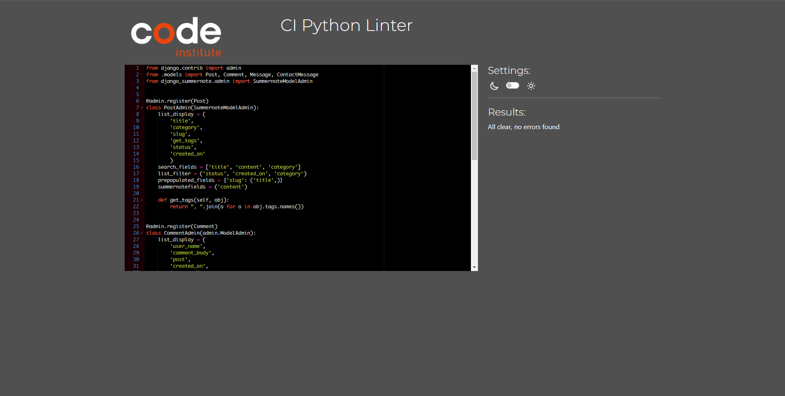
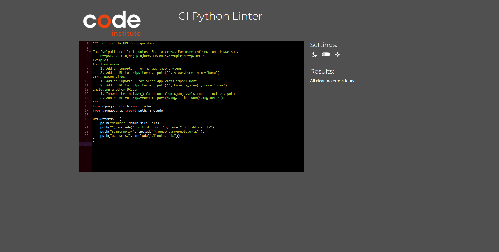

# Testing

Visit the deployed site: [CraftsCircle](https://craftscircle-9727f9958766.herokuapp.com/)

- - -

## CONTENTS

- [Testing](#testing)
  - [CONTENTS](#contents)
  - [AUTOMATED TESTING](#automated-testing)
    - [HTML Validation](#html-validation)
    - [CSS Validation](#css-validation)
    - [JS Validation](#js-validation)
    - [Python Validation](#python-validation)
    - [Lighthouse](#lighthouse)
  - [MANUAL TESTING](#manual-testing)
    - [Testing User Stories](#testing-user-stories)
    - [Full Testing](#full-testing)
    - [Known Bugs](#known-bugs)
    - [Solved Bugs](#solved-bugs)

Testing was ongoing throughout the entire build. I utilized Chrome developer tools whilst building to pinpoint and troubleshoot any issues as I went along.

During development I made use of google developer tools to ensure everything was working correctly and to assist with troubleshooting when things were not working as expected.

I have gone through each page using google chrome developer tools to ensure that each page is responsive on a variety of different screen sizes and devices.

- [W3C](https://validator.w3.org/) was used to check the HMTL & CSS.
- [CI linter](https://pep8ci.herokuapp.com/) was used to check Python code
- [JSHint](https://jshint.com/) was used to check Java Script
- - -

## AUTOMATED TESTING

  While testing, I encountered a few errors that are related to summernote and HTMX code, And that are not related to my code. And are a common issue.
  
  - 

    
Summernote Errors

    

    

  - 

    
HTMX Errors

    

    

### HTML Validation

  

  
Home HTML

  

  

  
  

  
About HTML

  

  

  

  
Contact HTML

  

  

  

  
My Page HTML 

  

  

  

  
Favorite HTML 

  

  

 
  

  
Categories HTML 

  

  

 
  

  
Item HTML 

  

  

 
  

  
Search HTML 

  

  

  

  
Tags HTML 

  

  

### CSS Validation

  

  
Index CSS

  

  

  

  
About CSS

  

  

  

  
Contact CSS

  

  

  

  
Add Item CSS

  

  

  

  
Confirmation CSS

  

  

  

  
Favorite CSS

  

  

  

  
Item CSS

  

  

  

  
Login CSS

  

  

### JS Validation

  

  
Menu JS

  

  

  

  
Slider JS

  

  

### pYTHON Validation

  

  
Admin Python

  

  

  

  
Forms Python

  

  

  

  
Mixins Python

  

  

  

  
Models Python

  

  

  

  
Settings Python

  

  

  

  
Urls Python

  

  

  

  
App Urls Python

  

  

  

  
Views Python

  

  

- - -

### Lighthouse

I used Lighthouse within the Chrome Developer Tools to test the performance, accessibility, best practices and SEO of the website.

Overall, the lighthouse scores are good. To achieve better scores I converted all images to the webp format.

Home Page

Desktop

Mobile

About Page

Desktop

Mobile

Contact Page

Desktop

Mobile

Category Page

Desktop

Mobile

My Page

Desktop

Mobile

Favorite Page

Desktop

Mobile

Search Page

Desktop

Mobile

Item Page

Desktop

Mobile

Tags Page

Desktop

Mobile

Forms

Desktop

Mobile

 

- - -

## MANUAL TESTING

### Testing User Stories

`Epic: View Items`

| Goals | How are they achieved? | Links & Images |
| :--- | :--- | :--- |
|As a unregistered user / registered user / manager I can view a slider of random items so that I can choose one of the items| By creating a dynamic random images slider on the home page|[Slider](documentation/slider.jpg)
|As a unregistered user / registered user / manager I can view a list of items so that I can choose an item to check| By creating Items list |[Items list](documentation/items_list.jpg)
|As a unregistered user / registered user / manager I can click on an item so that I can open the items page and check the information| By creating Item page|[Items page](documentation/page_item.jpg)
|As a unregistered user / registered user / manager I can click on a featured item post so that I can open the items page and check the information| By creating a featured post on the home page|[Featured post](documentation/featured_post.jpg)
|As a unregistered user / registered user / manager I can search items by title so that I can find the item I need| By creating a search bar|[Search bar desktop](documentation/search_bar_desktop.jpg), [Search bar mobile](documentation/search_bar_mobile.jpg)
|As a registered user / manager I can click on favorite page so that I can check the items I have liked| By creating a favorite page|[Favorite page](documentation/page_favorite.jpg)
|As a manager I can click on my so that I can open my items page and be able to add, edit, and delete| By creating my page and add / edit item page and CRUD functionality |[My page](documentation/page_my_page.jpg), [Add / Edit items page](documentation/page_my_page.jpg), [Delete confirmation](documentation/delete_confirmation.jpg) 
|As a unregistered user / registered user / manager I can click on a tag so that I can view the items with that tag| By creating Tags and implement taggit library | [Tags](documentation/tags_animation.gif) 
|As a unregistered user / registered user / manager I can click on a trending post from a list so that I can view the item information| By creating a trending items list in the side panel |[Trending](documentation/trending.jpg)
|As a unregistered user / registered user / manager I can click on a category so that I can view the items in that category| By creating a category filter in the side panel and a category page | [Category page](documentation/page_category.jpg), [Categories](documentation/category_animation.jpg)

 

`Epic: Items CRUD`

| Goals | How are they achieved? | Links & Images |
| :--- | :--- | :--- |
|As a manager I can create a draft item post so that I can post it later if not finished| By implementing CRUD functionality on the frontend and adding status to each post|[Add item](documentation/page_add_item.jpg)
|As a manager I can create an item post with text and images so that I can show my items to other users| By implementing CRUD functionality on the frontend |[Add item](documentation/page_add_item.jpg), [Item page](documentation/page_item.jpg)
|As a manager I can delete an item post so that I can manage my content| By implementing CRUD functionality on the frontend and creating my page |[My page](documentation/page_my_page.jpg)
|As a manager I can update an item post so that I can change the content of the post| By implementing CRUD functionality on the frontend|[Edit item](documentation/page_add_item.jpg)
|As an admin I can approve the comments on items posts so that I can filter the comments| By adding approved function to the Comments model|[Admin panel](documentation/admin_comments.jpg)

 

`Epic: Registration / Login`

| Goals | How are they achieved? | Links & Images |
| :--- | :--- | :--- |
|As an unregistered user I can register an account so that I can interact with other users or post my items| By implementing user registration functionality with allauth library and crispy forms|[Register page](documentation/register.jpg)
|As a registered user / manager I can login in to my account so that I can post items or leave comments, likes| By implementing user registration functionality with allauth library and crispy forms|[Login page](documentation/login.jpg)

 

`Epic: Item Interaction`

| Goals | How are they achieved? | Links & Images |
| :--- | :--- | :--- |
|As a registered user / manager I can click the like button so that I can like or unlike the item| By adding the like functionality in the item page|[Like](documentation/like.jpg)
|As an unregistered user / registered user / manager I can view the number of comments for the item so that I can check popular items| By adding a comment counter to each post|[Comment counter](documentation/like.jpg)
|As an unregistered user / registered user / manager I can view the number of likes for the item so that I can check popular items| By adding a like counter to each post|[Like counter](documentation/like.jpg)

 

`Epic: Comments`

| Goals | How are they achieved? | Links & Images |
| :--- | :--- | :--- |
|As a registered user / manager I can leave a comment on an item post so that I can interact with other users| By adding a comment form to the item page|[Comment form](documentation/comment_1.jpg)
|As an unregistered user / registered user / manager I can view the comments on a post so that I can read users comments| By adding a comment form to the item page|[Comment form](documentation/comment_1.jpg)

 

### Full Testing

Full testing was performed on the following devices, and additional testing for other devices was carried out using developer tools:

windows laptop, ultrawide 20" monitor, 16:9 24" monitor, 16:9 17" monitor.

Each device tested the site using the following browsers:

Google Chrome on Windows, Edge

`Home Page`

| Feature | Expected Outcome | Testing Performed | Result | Pass/Fail |
| --- | --- | --- | --- | --- |
| **NAVBAR** |  |  |  |  |
|  |  |  |  |  |
| Logo link | When clicked you are redirected to the home page | Clicked Logo | Redirected to home page | Pass|
| Home link | When clicked you are redirected to the home page | Clicked the link | Redirected to home page | Pass|
| About link | When clicked you are redirected to the About page | Clicked the link | Redirected to About page | Pass|
| Contact link | When clicked you are redirected to the Contact page | Clicked the link | Redirected to Contact page | Pass|
| Contact link | When clicked you are redirected to the Contact page | Clicked the link | Redirected to Contact page | Pass|
| Home link hover | When hover back ground highlights | Hover over the link | Background highlighted | Pass|
| About link hover | When hover back ground highlights  | Hover over the link | Background highlighted | Pass|
| Contact link hover | When hover back ground highlights  | Hover over the link | Background highlighted | Pass|
| Contact link hover | When hover back ground highlights  | Hover over the link | Background highlighted | Pass|
| Search bar hover | When hover search bar expands | Hover over search bar | Search bar expanded | Pass|
| Search bar | When clicked search bar get focus | Click search bar | Search got focus | Pass|
| Search bar | When query submit search page opens with result| Submit query | Search page opened with result | Pass|
| Search bar (no results) | When query submit search page opens with message "No items available"| Submit query | Search page opened with message "No items available"| Pass|
| User menu (unregistered user) | When clicked drop down menu appears (register, login)| Clicked menu | Drop down menu appeared (register, login)| Pass|
| User menu (registered user) | When clicked drop down menu appears (hi user, favorite, logout)| Clicked menu | Drop down menu appeared (hi user, favorite, logout)| Pass|
| User menu (registered manager) | When clicked drop down menu appears (hi manager, add item, my page, favorite, logout)| Clicked menu | Drop down menu appeared (hi manager, add item, my page, favorite, logout)| Pass|
| User menu > favorite | When clicked opens the favorite page| Clicked link | Favorite page opened | Pass|
| User menu > favorite | When clicked opens the my page with message "No items available"| Clicked link | Favorite page opened with message "No items available"| Pass|
| User menu > my page | When clicked opens the my page| Clicked link | My page opened | Pass|
| User menu > my page (no items)| When clicked opens the my page with message "No items available" | Clicked link | My page opened with message "No items available"| Pass|
| User menu > add item | When clicked opens the add item page| Clicked link | Add item page opened | Pass|
| User menu > log out | When clicked opens the logout confirmation page | Clicked link | Logout confirmation page  opened | Pass|
| **FOOTER** |  |  |  |  |
|  |  |  |  |  |
| Facebook link | When clicked opens Facebook in a new page | Clicked link | Opened Facebook in a new page | Pass |
| Twitter link | When clicked opens Twitter in a new page | Clicked link | Opened Twitter in a new page | Pass |
| Instagram link | When clicked opens Instagram in a new page | Clicked link | Opened Instagram in a new page | Pass |
| Youtube link | When clicked opens Youtube in a new page | Clicked link | Opened Youtube in a new page | Pass |
| **SLIDER** |  |  |  |  |
|  |  |  |  |  |
| Slider right arrow | When clicked next slide appears | Clicked the button| Next slide appeared | Pass |
| Slider left arrow | When clicked previous slide appears | Clicked the button| Previous slide appeared | Pass |
| Slider dots | When clicked the slide that is linked to the dot appears | Clicked the button| The slide that is linked to the dot appeared | Pass |
| Slider description | When clicked the item page opens | Clicked the button| The item page opened | Pass |
| Slider | After five seconds the slide changes to the next one | Waited five seconds | The slide changed to the next one | Pass |
| **FEATURED POST** |  |  |  |  |
|  |  |  |  |  |
| Featured link | When clicked the item page opens | Clicked the link| The item page opened | Pass |
| Featured link (like) | When a post have the biggest number of likes it becomes the featured post | Added likes | The item became the featured post| Pass |
| **CATEGORIES** |  |  |  |  |
|  |  |  |  |  |
| Category link | When clicked opens the category page with items from that category| Clicked the link| The category page opened with items from that category | Pass |
| Category link (no items)| When clicked opens the category page with message "No items available" | Clicked the link| The category page opened with message "No items available" | Pass |
| Category link hover | When hovered background highlights | Link hovered | background highlighted | Pass |
| **TRENDING** |  |  |  |  |
|  |  |  |  |  |
| Trending post link | When clicked opens the item page | Clicked the link| Opened the item page | Pass |
| Trending post link hover | When hovered image and text background highlights | Link hovered | Image and text background highlighted | Pass |
| Trending list (likes) | When adding likes the item order gets higher | Added likes to an item | The item order in the list got higher | Pass |
| **TAGS** |  |  |  |  |
|  |  |  |  |  |
| Tag | When clicked opens tags page with items list of the same tag | Clicked the tag| Tags page opened with items list of the same tag | Pass |
| Tag hover | When hovered the background highlights | Tag hovered | the background highlighted | Pass |
| **ITEMS** |  |  |  |  |
|  |  |  |  |  |
| Item link| When clicked the item page opens | Clicked the link| The item page opened | Pass |
| Item lazy loading| When page scrolled down new items appears | Scrolled down | New items appeared  | Pass |

 

`Contact Page`

| Feature | Expected Outcome | Testing Performed | Result | Pass/Fail |
| --- | --- | --- | --- | --- |
| **FORM** |  |  |  |  |
|  |  |  |  |  |
| Name input | When clicked the input area get focus | Clicked input| input area get focus | Pass|
| Email input | When clicked the input area get focus | Clicked input| input area get focus | Pass|
| Message input | When clicked the input area get focus | Clicked input| input area get focus | Pass|
| Submit button | When hover background and text color changes | Button hovered | Background and text color changed | Pass|
| Submit button (valid form) | When clicked form submits | Button clicked | Form submitted | Pass|
| Submit button (nonvalid form) | When clicked alert message fill required appears | Button clicked | Alert message fill required appeared | Pass|

 

`Add / Edit Item Page`

| Feature | Expected Outcome | Testing Performed | Result | Pass/Fail |
| --- | --- | --- | --- | --- |
| **FORM** |  |  |  |  |
|  |  |  |  |  |
| Title input | When clicked the input area get focus | Clicked input| input area get focus | Pass|
| Tags input | When clicked the input area get focus | Clicked input| input area get focus | Pass|
| Content input | When clicked the input area get focus | Clicked input| input area get focus | Pass|
| Category input | When clicked drop down menu appears | Clicked input| Drop down menu appeared | Pass|
| Status input | When clicked drop down menu appears | Clicked input| Drop down menu appeared | Pass|
| slider_image | When clicked file upload window appears | Clicked button| File upload window appeared | Pass|
| Listing_image | When clicked file upload window appears | Clicked button| File upload window appeared | Pass|
| Select image | When image selected image name appears | Selected image| Image name appeared | Pass|
| Submit button hover | When hover background and text color changes | Button hovered | Background and text color changed | Pass|
| Submit button (valid form) | When clicked form submits | Button clicked | Form submitted | Pass|
| Submit button (nonvalid form) | When clicked alert message fill required appears | Button clicked | Alert message fill required appeared | Pass|

 

`Register Page`

| Feature | Expected Outcome | Testing Performed | Result | Pass/Fail |
| --- | --- | --- | --- | --- |
| **FORM** |  |  |  |  |
|  |  |  |  |  |
| User_name input | When clicked the input area get focus | Clicked input| input area get focus | Pass|
| Email input | When clicked the input area get focus | Clicked input| input area get focus | Pass|
| Password  | When clicked the input area get focus | Clicked input| input area get focus | Pass|
| Password again input | When clicked the input area get focus | Clicked input| input area get focus | Pass|
| Group input  | When clicked a drop down menu appears | Clicked input| A drop down menu appeared | Pass|
| Submit button hover | When hover background and text color changes | Button hovered | Background and text color changed | Pass|
| Submit button  (valid form) | When clicked form submits, user logsin | Button clicked | Form submitted, user logedin | Pass|
| Submit button  (nonvalid form) | When clicked alert message fill required appears | Button clicked | Alert message fill required appeared | Pass|

 

`Login Page`

| Feature | Expected Outcome | Testing Performed | Result | Pass/Fail |
| --- | --- | --- | --- | --- |
| **FORM** |  |  |  |  |
|  |  |  |  |  |
| User_name input | When clicked the input area get focus | Clicked input| input area get focus | Pass|
| Password | When clicked the input area get focus | Clicked input| input area get focus | Pass|
| Submit button hover | When hover background and text color changes | Button hovered | Background and text color changed | Pass|
| Submit button (valid form) | When clicked form submits, user logsin | Button clicked | Form submitted, user logedin | Pass|
| Submit button (nonvalid form) | When clicked alert message fill required appears | Button clicked | Alert message fill required appeared | Pass|

 

`Logout confirmation Page`

| Feature | Expected Outcome | Testing Performed | Result | Pass/Fail |
| --- | --- | --- | --- | --- |
| **FORM** |  |  |  |  |
|  |  |  |  |  |
| Sign out button (valid form) | When clicked the user logsout | Button clicked | the user logedout| Pass|

 

`My Page`

| Feature | Expected Outcome | Testing Performed | Result | Pass/Fail |
| --- | --- | --- | --- | --- |
| **ITEMS** |  |  |  |  |
|  |  |  |  |  |
| Add item button | When clicked opens add item page | Clicked button | Add item page opened | Pass|
| Edit button | When clicked opens edit item page | Clicked button | Edit item page opened | Pass|
| Delete button | When clicked delete confirmation appears | Clicked button | Delete confirmation appeared | Pass|
| Item link | When clicked opens the item page | Clicked link | The item page opened | Pass|
| Item lazy loading| When page scrolled down new items appears | Scrolled down | New items appeared  | Pass |

 

`Favorite Page`

| Feature | Expected Outcome | Testing Performed | Result | Pass/Fail |
| --- | --- | --- | --- | --- |
| **ITEMS** |  |  |  |  |
|  |  |  |  |  |
| Item link | When clicked opens the item page | Clicked link | The item page opened | Pass|
| Item lazy loading| When page scrolled down new items appears | Scrolled down | New items appeared  | Pass |

 

`Category Page`

| Feature | Expected Outcome | Testing Performed | Result | Pass/Fail |
| --- | --- | --- | --- | --- |
| **ITEMS** |  |  |  |  |
|  |  |  |  |  |
| Item link | When clicked opens the item page | Clicked link | The item page opened | Pass|
| Item lazy loading| When page scrolled down new items appears | Scrolled down | New items appeared  | Pass |

 

`Search Page`

| Feature | Expected Outcome | Testing Performed | Result | Pass/Fail |
| --- | --- | --- | --- | --- |
| **ITEMS** |  |  |  |  |
|  |  |  |  |  |
| Item link | When clicked opens the item page | Clicked link | The item page opened | Pass|
| Item lazy loading| When page scrolled down new items appears | Scrolled down | New items appeared  | Pass |

 

`Delete confirmation Page`

| Feature | Expected Outcome | Testing Performed | Result | Pass/Fail |
| --- | --- | --- | --- | --- |
| **ITEMS** |  |  |  |  |
|  |  |  |  |  |
| Delete button | When clicked The item is deleted | Clicked button| The item got deleted | Pass|
| Close button | When clicked redirects to the item page  | Clicked button | Got redirected to the item page | Pass |

 

`Item Page`

| Feature | Expected Outcome | Testing Performed | Result | Pass/Fail |
| --- | --- | --- | --- | --- |
| **ITEMS** |  |  |  |  |
|  |  |  |  |  |
| Like button (unliked) | When clicked The item is liked| Clicked button | The item got liked | Pass|
| Like button (liked) | When clicked The item is unliked| Clicked button | The item got unliked | Pass|
| Text area | When clicked the text area get focus| Clicked Area | The text area got focus | Pass|
| Submit button (valid form)| When clicked The form submits | Clicked button | The form submitted | Pass|
| Submit button (nonvalid form)| When clicked alert message appears fill required | Clicked button | alert message appeared fill required | Pass|
| Signup to comment button (unregistered user)| When clicked opens the login page | Clicked button | The login page opened  | Pass|

 

### Known Bugs

All of the bugs were fixed during the project.

 

### Solved Bugs

| Bug No | Bug Issue | How Resolved |
| :--- | :--- | :--- |
| 1 | when submitting a comment and was not approved, other users can not submit there comments | modified the code that was based on CodeInstitute walk through so that it can check if it is the same user|
| 2 | when submitting a comment and the user refreshes the page, the comment resubmit again | modified the code that was based on CodeInstitute walk through so that it can redirect the user to the same page to prevent this behavior |
| 3 | Django template bug when using safe - truncatwords filter on summernote rich text, the <b> tags misses all the html file | used striptags - safe - truncatewords to prevent this problem for item previews |
| 4 | un used tags appears in the tap sections when deleting an item, taggit library does not have the delete when not in use function or something similar | a code that checks if the tags for the deleted item are used anywhere and if not, deletes them. and for the items that was deleted from the admin panel a code that always checks if the tags are used or not and deletes them executes with the index page |
| 5 | the footer comes up if the page is empty | used a vertical flexbox to keep the page divided into three sections header, main, and footer |
| 6 | the HTMX attributes needed for the lazy loading to work give 400 error when on the last item of the list because it wants to load the next page | used a parameter in the context that passes the last items id and in the template is checked if the current item is the last item and not add these attributes if so|
| 7 | when trying to submit empty form the submit button become disabled because of the JS implemented code to prevent accedental resubmissions  | Added form fields validation function to the code |

Back to [README.md](README.md)